<!-- ใช้สำหรับสมัครงาน Homefittools เท่านั้น (For Homefittools job application only) -->
# HomeFitTools – หน้าสินค้า Benches & Racks

งานทดสอบ Front-end ครับ ผมรื้อหน้า **Benches & Racks** ทำใหม่ให้ดูล้ำขึ้น เหมาะกับร้านขายอุปกรณ์ออกกำลังกาย

หน้าอ้างอิง: <https://www.homefittools.com/products/weighttraining/fitness-equipment/bench.html>

> ใช้สำหรับสมัครงาน Homefittools เท่านั้นนะครับ

## ที่ต้องบอกกันก่อน (ไม่อยากให้เข้าใจผิด)

- ฟอร์มแจ้งโอนกับขอใบเสนอราคาทำฝั่งหน้าเว็บอย่างเดียว กดส่งแล้วขึ้นข้อความขอบคุณเฉย ๆ ยังไม่ได้ต่อ backend
  (จะต่อ API ก็แก้ที่ `js/ui/forms.js`)
- น้องฟิตเป็นระบบจับคีย์เวิร์ด ไม่ใช่ AI จริง (อยากเปลี่ยนก็แก้ `botReply()` ใน `js/systems/chat.js`)
- เนื้อหาวิธีสั่งซื้อ บริการ การรับประกัน กับบทความ ผมเขียนแบบกลาง ๆ เอง ให้เจ้าของร้านตรวจอีกทีจะดีสุด
- ลิงก์หมวดหมู่ส่วนใหญ่ชี้ไปหน้ารวมสินค้าของเว็บเดิม ปุ่มโปรโมชันก็ชี้ไปหน้าแรกเว็บเดิม
- รูปสินค้า ชื่อ ราคา อ้างอิงจาก homefittools.com เป็นของเจ้าของเว็บนะครับ
---

## หน้าตาเว็บ (Screenshot)

ภาพทั้งหมดแคปจากตัวเว็บจริง เก็บไว้ที่ `docs/screenshots/`

### คอม (1440px)

| หน้าแรก (โหมดสว่าง) | เมกะเมนู "สินค้าของเรา" |
|---|---|
| 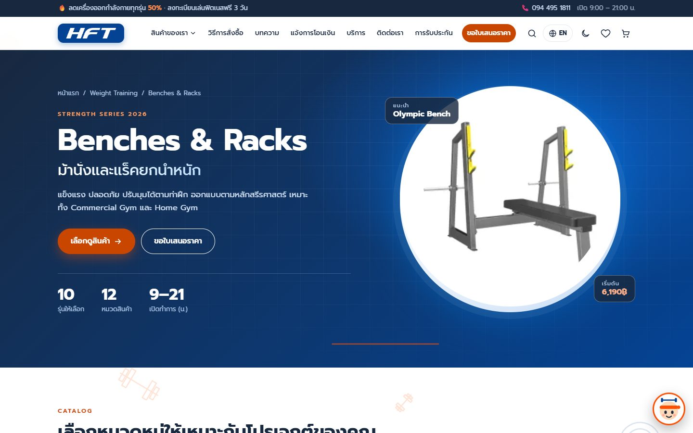 | 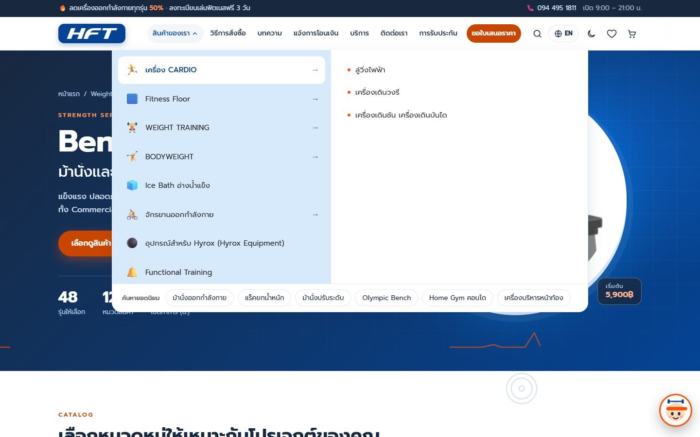 |

| รายการสินค้า | มินิตะกร้า (เด้งตอนกดเพิ่มสินค้า) |
|---|---|
| 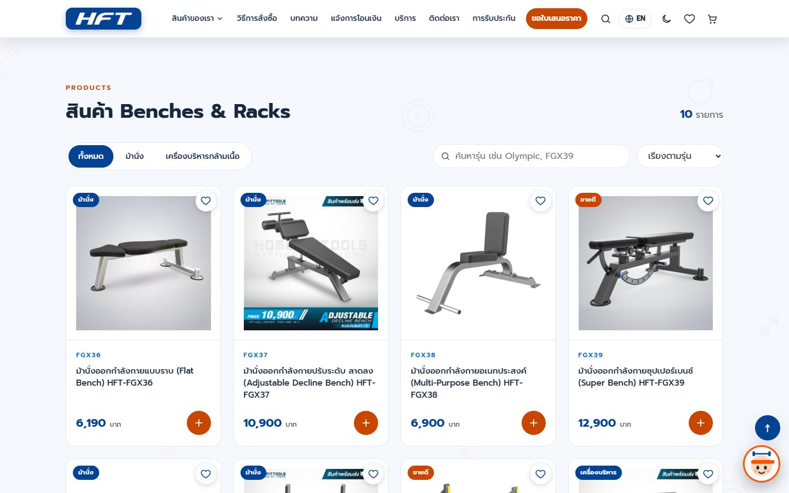 | 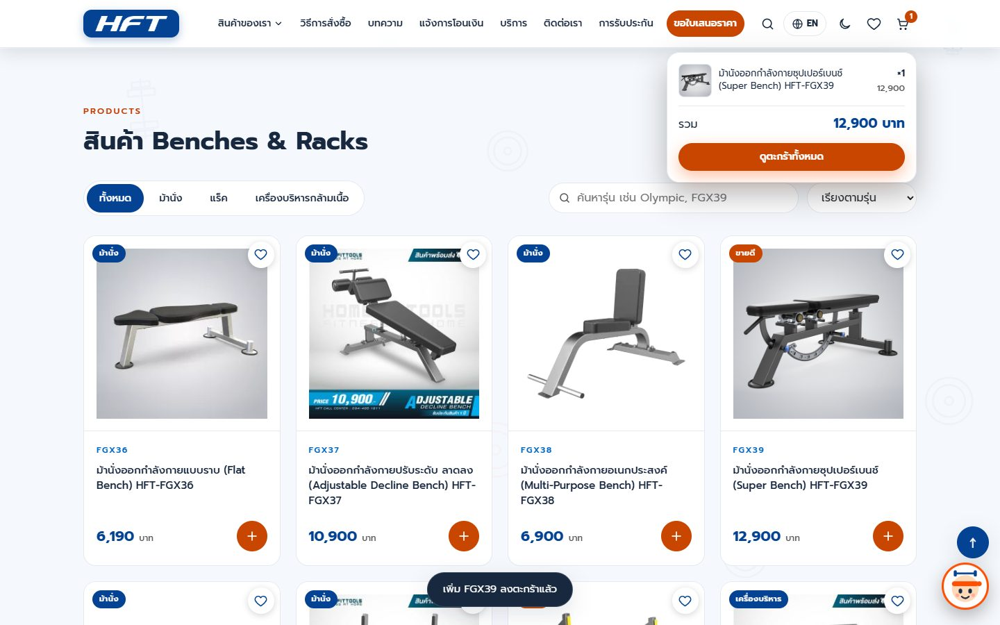 |

| ดูรายละเอียดด่วน | บทความ SEO |
|---|---|
| 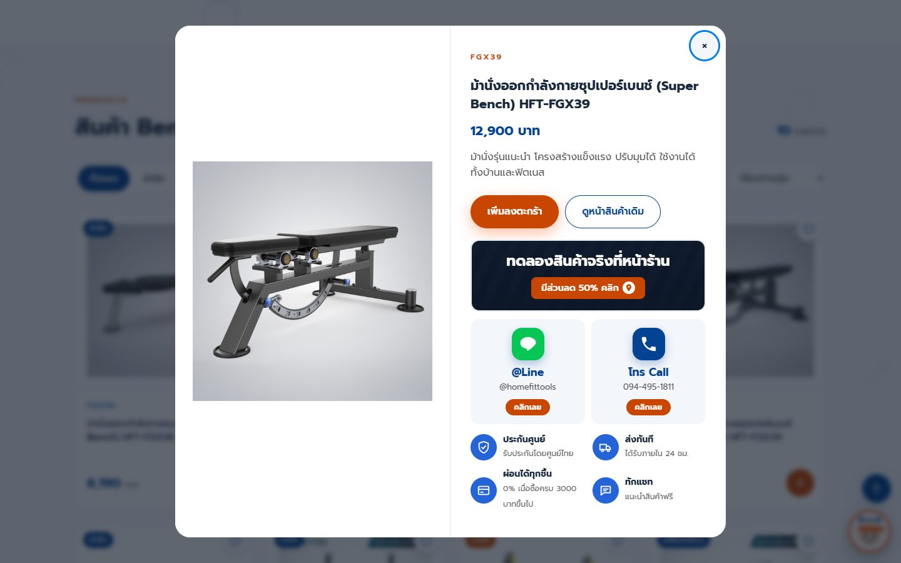 | 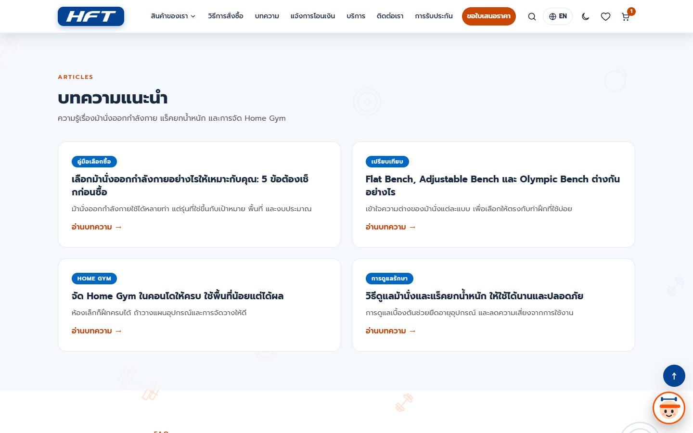 |

| ช่องทางติดต่อ + แชทน้องฟิต | โหมดกลางคืน |
|---|---|
| 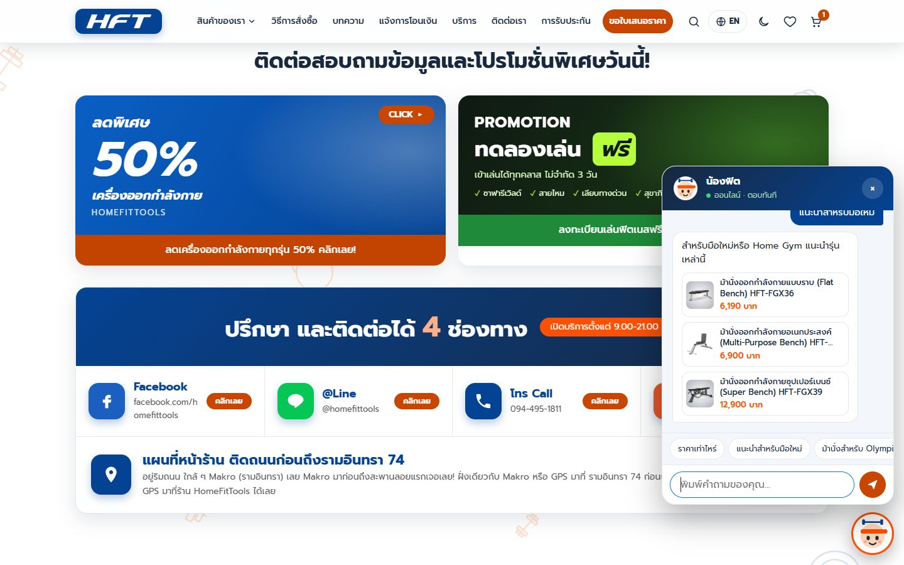 | 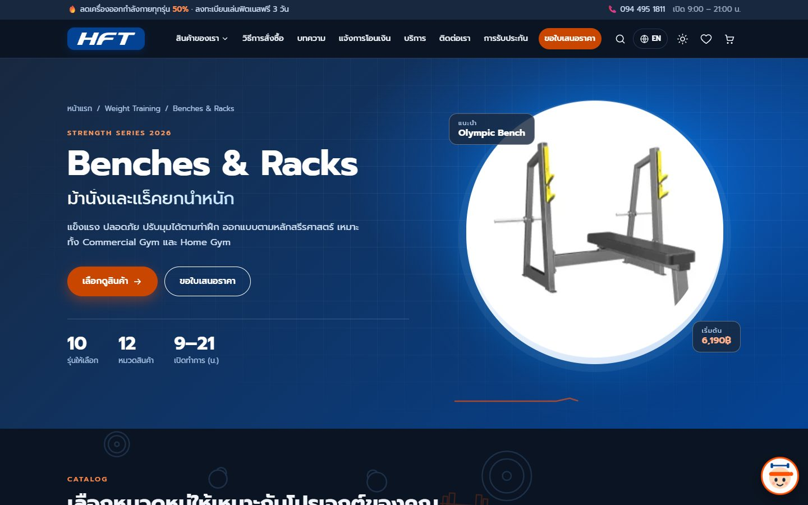 |

| โหมดกลางคืน + English |
|---|
| 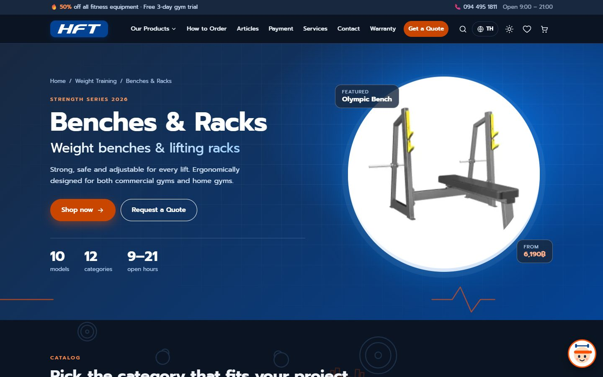 |

ส่วนติดต่อทั้งหมด (โปรโมชัน 2 ใบ + 4 ช่องทาง + แผนที่) ดูได้ที่ `docs/screenshots/desktop-contact.jpg`

### มือถือ (390px)

<table>
  <tr>
    <td align="center">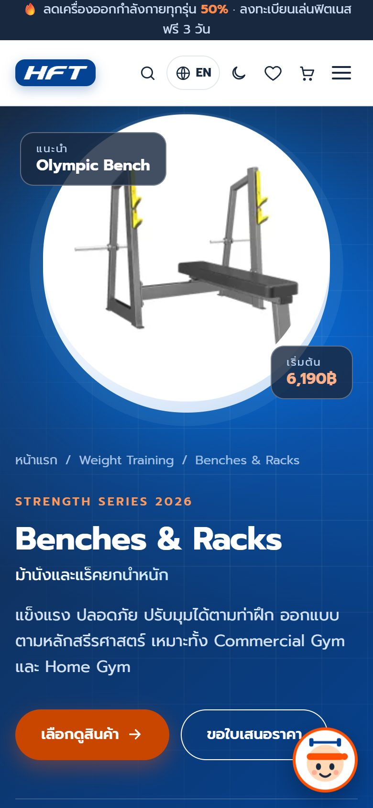<br>หน้าแรก</td>
    <td align="center">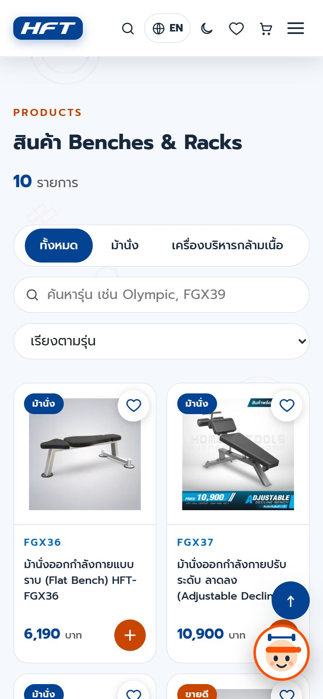<br>รายการสินค้า</td>
    <td align="center">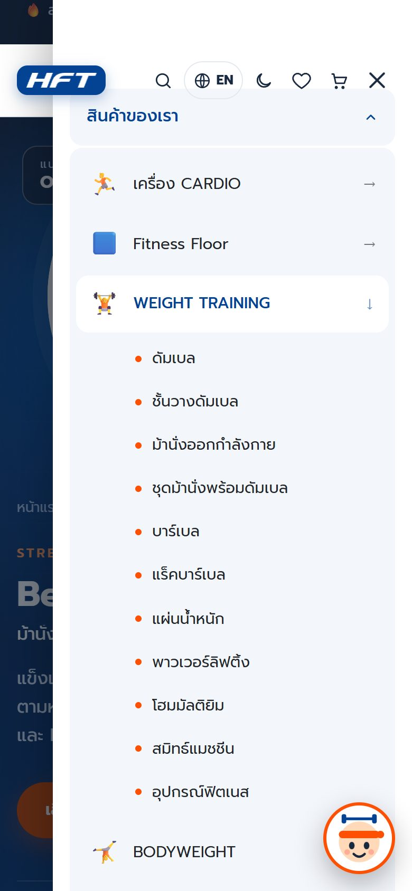<br>เมนู + เมกะเมนูแบบกดขยาย</td>
  </tr>
</table>


## ไฟล์อยู่ตรงไหนบ้าง

```
HFT_code/
├─ index.html          หน้าเว็บ (CSS ที่ย่อแล้วฝังอยู่ข้างใน + โหลด js/app.min.js)
├─ style.css           CSS ตัวจริง ตัวที่ไว้แก้
├─ style.min.css       CSS ที่ build แล้ว
├─ build.js            สคริปต์ build (รวมไฟล์ + ย่อขนาด)
├─ assets/             โลโก้ HFT กับ favicon (เอามาจากเว็บต้นฉบับ)
└─ js/
   ├─ app.min.js       JS ที่ build แล้ว ตัวที่หน้าเว็บโหลดจริง
   ├─ main.js          จุดสตาร์ท เรียกทุกโมดูลมาทำงานทีละชิ้น
   ├─ core/            namespace, utils, state, i18n (ตัวแปลภาษา)
   ├─ data/            products, menu (เมกะเมนู/ไซต์แมป/หมวดหมู่), dictionary (คำแปลอังกฤษ)
   ├─ ui/              toast, cart, cartpanel, minicart, modal, products,
   │                   navigation, sections, forms, controls, effects
   └─ systems/         search, chat (น้องฟิต), seo (JSON-LD), background (แอนิเมชันพื้นหลัง)
```

แยก JS เป็นชิ้น ๆ ครับ ข้อมูลส่วนข้อมูล ระบบส่วนระบบ หน้าตาส่วนหน้าตา
ทุกชิ้นเกาะกับ `window.HFT` ไม่ได้ใช้ ES modules เพราะอยากให้ดับเบิลคลิกเปิดจากไฟล์ได้เลย
ส่วนไหนต้องวาดใหม่ตอนสลับภาษา ก็ลงทะเบียนไว้ด้วย `HFT.onRender(fn)`

## มีอะไรในเว็บบ้าง

**ตัวหน้าเว็บ**
- ส่วนหัวโทนเข้ม ตัวเลขนับขึ้น เส้นชีพจรวิ่ง ใช้สีเดิมของเว็บ (กรมท่า `#044394` / ฟ้า `#0080e8` / ส้ม `#fd5003`)
- หมวดหมู่ 8 หมวดข้างบน กับ "หมวดหมู่สินค้าทั้งหมด" 12 หมวดข้างล่าง
- สินค้า 10 รุ่น กรองประเภท ค้นหา เรียงราคาได้ (รูป ชื่อ ราคาเอามาจากเว็บเดิม)
- วิธีสั่งซื้อ, บริการ, การรับประกัน, บทความ SEO 4 บทความ, FAQ
- ฟอร์มแจ้งโอนเงินกับฟอร์มขอใบเสนอราคา (เช็กข้อมูลฝั่งหน้าเว็บให้)
- ช่องทางติดต่อ 4 ช่อง (Facebook, LINE @homefittools, โทร 094-495-1811, อีเมล) แผนที่หน้าร้าน และแบนเนอร์โปรโมชัน
- ฟุตเตอร์แบบเก่า พร้อมไซต์แมปสินค้า

**ของเล่นที่ใช้ได้จริง**
- เมกะเมนู "สินค้าของเรา" 13 หมวด (เอาเมาส์ชี้หรือแตะ) มีแถบคำค้นยอดนิยมไว้ช่วย SEO ด้วย
- ค้นหาในแถบเมนู กดปุ่มแว่นขยายหรือกด `/` ก็ได้ ค้นได้ทั้งสินค้า บทความ หมวดหมู่
- ตะกร้า + รายการโปรด เปิดเป็นแผงข้างได้ เพิ่ม/ลด/ลบ ดูยอดรวม ส่งต่อไปฟอร์มใบเสนอราคาได้ แล้วมีมินิตะกร้าเด้งให้ดูตอนชี้หรือกดเพิ่มสินค้า
- "ดูรายละเอียดด่วน" เป็น modal ที่มีแบนเนอร์ทดลองสินค้าจริงที่หน้าร้าน ปุ่ม LINE/โทร กับสิทธิพิเศษ 4 ข้อ
- แชทน้องฟิต ตัวการ์ตูนมุมขวาล่าง ตอบเรื่องราคา แนะนำรุ่น สั่งซื้อ รับประกัน ติดต่อ (ไทย/อังกฤษ)
- สลับภาษา **ไทย / English** ได้ และสลับโหมด **กลางวัน / กลางคืน** ได้
- พื้นหลังมีดัมเบล แผ่นน้ำหนัก เคตเทิลเบลลอยหมุน ๆ ให้ไม่จืด (ถ้าเครื่องตั้งลดการเคลื่อนไหวไว้ก็จะนิ่งเอง)

**ค่าเริ่มต้น:** เข้ามาครั้งแรกเป็น **ภาษาไทย + โหมดสว่าง** เสมอ ค่าที่กดเลือกเองจำไว้แค่ในการเข้าชมรอบนั้น
ส่วนตะกร้ากับรายการโปรดจำข้ามรอบให้

**ทุกขนาดจอ:** ลองมาแล้วตั้งแต่ 320 ถึง 1920px ทั้งไทยทั้งอังกฤษ ไม่มีล้นข้าง

## อยากแก้โค้ด

แก้ที่ไฟล์ต้นฉบับ (`style.css` กับไฟล์ใน `js/`) แล้วรัน:

```bash
node build.js
```

มันจะสร้าง `js/app.min.js`, `style.min.css` แล้วฝัง CSS ลง `index.html` ให้ใหม่
ต้องมี Node 18 ขึ้นไป รอบแรกมันจะโหลด esbuild ผ่าน `npx` เอง

## PageSpeed เป็นไงบ้าง

ผมลอง Lighthouse โหมดมือถือบนเครื่อง (เซิร์ฟเวอร์ที่บีบอัดไฟล์เหมือน GitHub Pages) ได้
Performance **99**, Accessibility **100**, Best Practices **100**, SEO **100**
(FCP 1.3 วิ, LCP 1.7 วิ, CLS 0.024) ของจริงบนเน็ตอาจขยับนิดหน่อยตามเครือข่าย

ที่ทำให้เร็วขึ้น: รูปหลักเปลี่ยนเป็น webp ตัวเล็กแล้วโหลดล่วงหน้า, รูปสินค้าโหลดตอนเลื่อนใกล้ถึง,
ฟอนต์โหลดหลังหน้าเสร็จ, ฝัง CSS, รวมกับย่อ JS, แล้วหั่นงาน JS เป็นชิ้นเล็กหลังภาพแรกขึ้น

ที่ยังไม่ถึง 100 เต็ม: TBT ยังอยู่ราว 80–100 ms, cache ของ GitHub Pages ผมแก้ไม่ได้,
รูปสินค้ายัง hot-link จากเว็บเดิม, ฟอนต์ Prompt ยังโหลดจาก Google


