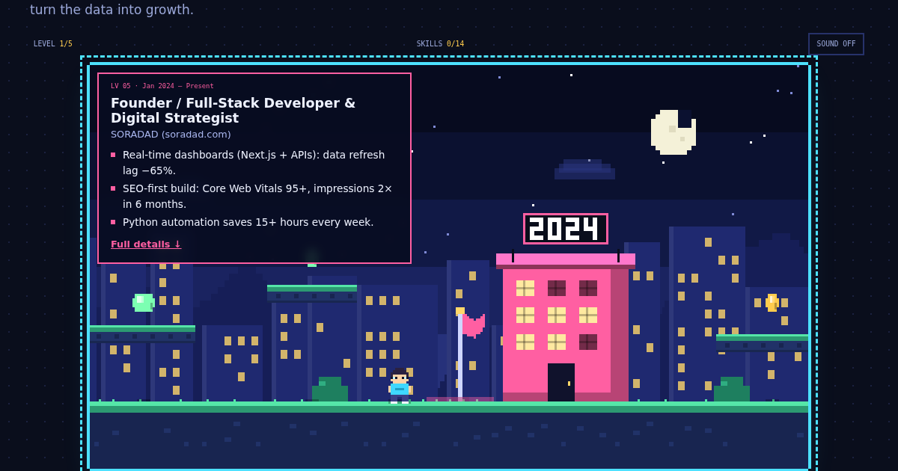

<div align="center">
# 🎮 Surajak Chansamrit — Pixel Resume
 
**Full-Stack Web Developer & Technical SEO Specialist**
 
An interactive pixel-art resume. Walk through 8+ years of career "levels", collect skills, then read the full resume.
 
[**▶ Play the live site**](https://soradadofficial.github.io/) · [Resume (EN, PDF)](assets/Surajak-Chansamrit-Resume-EN.pdf) · [Resume (TH, PDF)](assets/Surajak-Chansamrit-Resume-TH.pdf)
 

 
</div>
---
 
## ✨ Features
 
- **Resume Quest** — a canvas platformer (no libraries, no image assets). Each checkpoint is a job; each coin is a skill.
- **Clean resume below the game** — About, key numbers, experience timeline, skill tree, projects, awards, contact.
- **EN / TH** language switch and **dark / light** theme (remembers your choice).
- **Mobile friendly** with on-screen touch controls; respects `prefers-reduced-motion`.
- **SEO-ready** — semantic HTML, meta tags, Open Graph, JSON-LD `Person` schema, print stylesheet.
- **Zero build step** — plain HTML, CSS and vanilla JS. Works on GitHub Pages as-is.
## 🕹️ Controls
 
| Action | Keys |
| --- | --- |
| Move | `←` `→` or `A` `D` |
| Jump | `Space` or `↑` / `W` |
| Exit game | `Esc` |
| Fast travel | Click a year chip under the game |
| Secret | `↑ ↑ ↓ ↓ ← → ← → B A` |
 
## 🚀 Deploy to GitHub Pages
 
1. Create a repository and upload **all files in this folder** (keep `.nojekyll`).
2. Go to **Settings → Pages**, choose **Deploy from a branch**, select `main` and `/ (root)`, then **Save**.
3. Wait a minute. The site is live at `https://soradadofficial.github.io/`
   (the repo must be named `soradadofficial.github.io` to get the root URL; a repo named `resume` gets `https://soradadofficial.github.io/resume/`).
4. In `index.html` add your canonical URL and make `og:image` absolute:
```html
   <link rel="canonical" href="https://soradadofficial.github.io/">
   <meta property="og:image" content="https://soradadofficial.github.io/og-image.png">
```
 
To preview locally, just open `index.html`, or run `python3 -m http.server` in this folder.
 
## 🗂️ Project structure
 
```
├── index.html            # page content (English, crawlable)
├── css/style.css         # pixel-modern theme, dark/light, responsive
├── js/
│   ├── app.js            # theme, language, animations, toast, easter egg
│   ├── game.js           # the canvas game
│   ├── stages.js         # career levels shown in the game (EN/TH)
│   └── i18n-th.js        # Thai translations (keyed by data-i18n)
├── assets/               # resume PDFs (EN / TH)
├── favicon.svg
├── og-image.png          # social preview
└── .nojekyll
```
 
## ✏️ Customizing
 
- **Text:** edit `index.html`; put the matching Thai text in `js/i18n-th.js` under the same `data-i18n` key.
- **Game levels:** `js/stages.js` (year, colour, position, short highlights).
- **Skill coins:** `COIN_DEF` in `js/game.js`.
- **Colours:** CSS variables at the top of `css/style.css`.
- **PDFs:** replace the files in `assets/` (keep the file names).
## 📬 Contact
 
- ✉️ azhime.blog@gmail.com
- 🌐 [soradad.com](https://soradad.com)
- 📍 Bang Kadi, Pathum Thani, Thailand
## 📄 License
 
© Surajak Chansamrit. Code is free to learn from; please don't republish this resume's personal content as your own.
 
